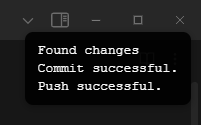
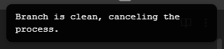

# Obsidian Auto Backup

This is a simple script to automatically backup your Obsidian vault to a git repository. It is written in batch script and intended to be used on Windows.

## Installation and Configuration

1. Clone this repository to your computer.

```bash
git clone git@github.com:MetinUsta/Obsidian-Auto-Backup.git
```

2. Create a new repository on GitHub. You can skip to step 5 if you already have a repository connected to your Obsidian vault.

3. Create a local git repository in your Obsidian vault.

```bash
cd /path/to/your/vault
git init -b main # or any name you want
```

4. Add the remote repository to your local repository.

```bash
git remote add origin <your-repository-url>
```

5. Modify the 'obsidian_auto_backup.bat' file, specifically the following lines:

```bash
line 11: cd "PATH/TO/YOUR/OBSIDIAN/VAULT"
line 42: git push origin <YOUR BRANCH NAME> > NUL 2>&1
```

## Usage

There are different ways to use this script:

1. Run the script manually by double-clicking on the 'obsidian_auto_backup.bat' file.

2. Run the script automatically by creating a scheduled task on Windows Task Scheduler.

3. Run the script automatically by installing the "Shell Commands" plugin on Obsidian and creating a new command.

## Things to Consider

- This script will add all the files in your Obsidian vault to the git repository. If you want to exclude some files, you can add them to a '.gitignore' file or modify the script.

- This script will use date and time as the commit message. If you want to change the commit message, you can modify the script.
    - When using "Shell Commands" plugin on Obsidian, you can prompt the user to enter a commit message. Later, you can use this commit message in the script.
    - There may be some errors with date and time parsing since the script is locale dependent. It is recommended to use the script with English locale.

- When using "Shell Commands" plugin on Obsidian, if you set the output channel for stdout as "Notification balloon" you will see messages related to the individual steps of the script.
    - e.g.
    ```
    Found changes
    Commit successful.
    Push successful.
    ```

    It will look like below:

    

    

- When using "Shell Commands" plugin on Obsidian, be careful with the triggering events. If you set the trigger as **"Obsidian quits"**, the execution of the script may be halted. Also be sure not to select a frequently triggered event since it may cause some performance issues.
    - **"Obsidian starts"** and **"Every n seconds"** with high second value (e.g. 300, 600) seem reasonable.
    - You can also set a hotkey for the command and run it manually. I set it as **"Ctrl + Alt + S"**.

## Acknowledgements

- [Obsidian](https://obsidian.md/)
- [Shell Commands](
    https://github.com/Taitava/obsidian-shellcommands
)

## Contributing
Pull requests are welcome. If you have any questions feel free to open an issue about it.